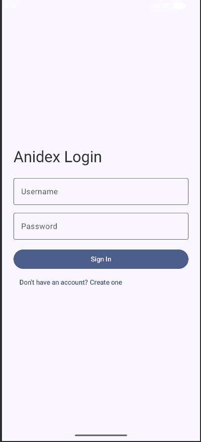
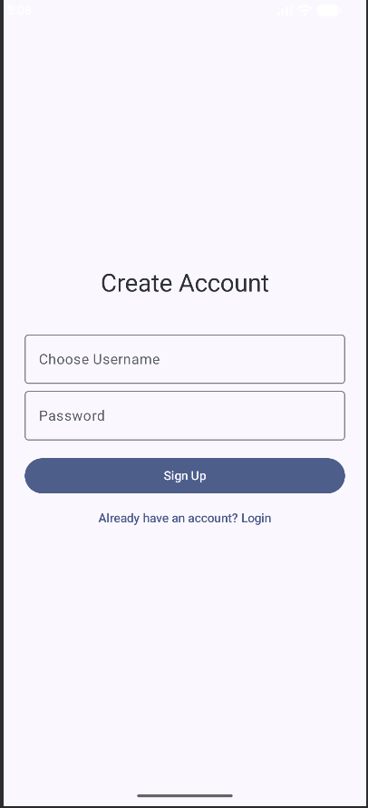
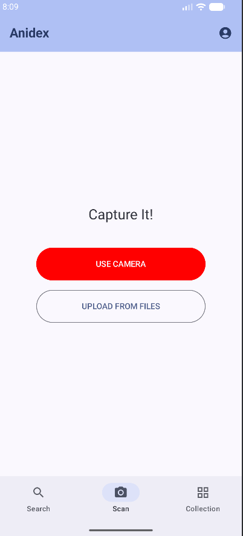
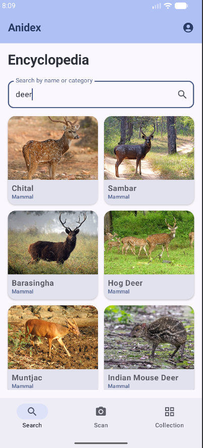
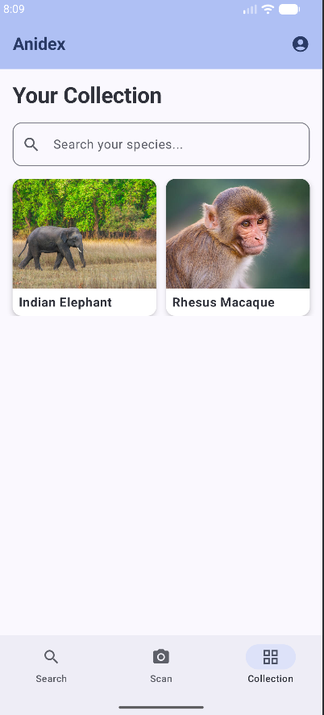
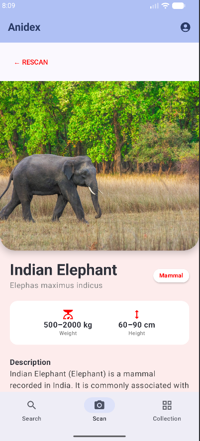

# 🐾 AniDex – Real-World Pokédex for Animals

AniDex is an intelligent Android application that recognizes animals from images and displays their details in a clean, card-based UI — inspired by a real-world Pokédex.

Users can capture or upload an image of an animal, and AniDex identifies the species (and breed where applicable) using deep learning models, then presents the results as an **Animal Card** containing useful information.

---

## 📸 App Screenshots

## 🚀 Features

- 📷 Capture or upload animal images
- 🧠 AI-powered animal recognition
- 🐾 Species and breed identification
- 🪪 Displays a detailed **Animal Card** with:
  - Animal name
  - Image preview
  - Basic traits & characteristics
- ⚡ Fast and lightweight inference
- 📱 Clean, mobile-first UI

---

##  How AniDex Works

1. **Image Input**  
   The user captures a photo or selects an image from the gallery.

2. **AI-Based Recognition**  
   The image is sent to a FastAPI backend where convolutional neural networks (CNNs) analyze and classify the animal.

3. **Prediction Processing**  
   The system determines the most likely species (and breed if available).

4. **Animal Card Display**  
   The app renders an **Animal Card UI**, presenting the detected animal along with its information in a simple and readable format.

---

## 🛠️ Tech Stack

### Android (Client)
- Kotlin
- Android Studio
- Retrofit
- Material Design

### Backend (Server)
- FastAPI
- Uvicorn
- Python

### Machine Learning
- Convolutional Neural Networks (CNNs)
- Optimized lightweight models for mobile usage

---

## Project Structure

AniDex/
├── client/ # Android application
├── server/ # FastAPI backend
├── public/ # Demo video & screenshots
└── README.md

---

## Use Cases

- Educational animal identification
- AI + mobile application demonstration
- Computer vision learning project
- Portfolio project showcasing ML + Android

---

##  Future Improvements

- Support for more animal categories
- Offline inference support
- Confidence score for predictions
- Expanded animal data (habitat, lifespan, diet)
- Cloud deployment

---

## Author

**AniDex**  
A personal project exploring Android development, machine learning, and computer vision.
